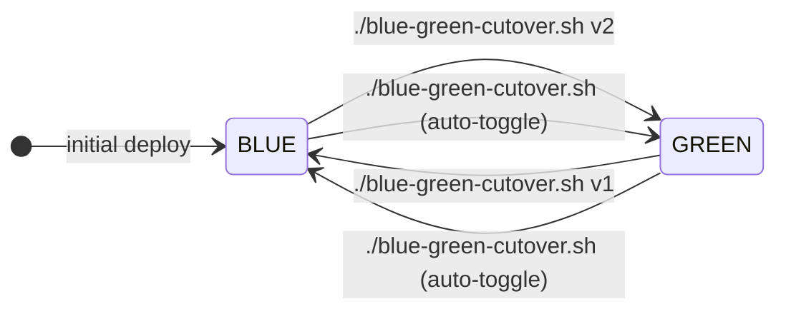
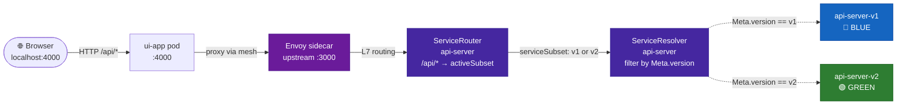

# Blue-Green Deployment — Testing Guide

This guide walks through the full blue-green cutover demo using Consul service mesh, the `api-server` v1/v2 deployments, and the version badge + live traffic chart in the UI.

> **TL;DR** — the cutover is a single command:
> ```bash
> ./scripts/blue-green-cutover.sh v2   # cut over to green
> ./scripts/blue-green-cutover.sh v1   # roll back to blue
> ./scripts/blue-green-cutover.sh      # auto-toggle
> ```
> The script builds the image, applies the deployment, waits for pods to be ready, then shifts routing — no manual steps required.



---

## Prerequisites

- The base POC is already running ([QUICKSTART.md](./QUICKSTART.md) completed)
- `kubectl` is targeting the correct context (`docker-desktop` or your cluster)
- Consul CRD controller is installed and healthy
- Docker daemon is running (the script builds images automatically)

```bash
kubectl get pods -n consul
kubectl get crd | grep consul
```

---

## Architecture Overview



The `ServiceRouter` pins **all traffic** to one subset at a time.  
The `ServiceResolver` maps subset names to pods via the `Service.Meta.version` tag — only the active subset's dotted arrow carries live traffic.  
A hard cutover is a single `kubectl patch` — no gradual split (that is covered in the canary demo).

---

## Step 1 — Open the UI and confirm BLUE (v1) is active

```bash
kubectl port-forward svc/ui-app 4000:4000
```

Open **http://localhost:4000** in your browser.

You should see:

```
API backend:  [V1]  🔵 Blue (stable)
```

The badge is derived from the `X-Api-Version` response header that the api-server sets based on `APP_VERSION`.

---

## Step 2 — Cut over to GREEN (v2)

Run the automated cutover script:

```bash
./scripts/blue-green-cutover.sh v2
```

The script does everything automatically:
1. Builds `api-server:v2` image via `docker build --build-arg APP_VERSION=v2`
2. Applies `consul/serviceresolver-blue-green.yaml` + `consul/servicerouter-blue-green.yaml`
3. Applies `api-server/k8s/deployment-v2.yaml`
4. Waits for the v2 pods to reach `2/2 Running` (Envoy sidecar included)
5. Patches `ServiceRouter → serviceSubset: v2` and `ServiceResolver → defaultSubset: v2`
6. Prints pod table + routing verification

Expected output:

```
=== Blue-Green Cutover: api-server ===
  Target  : v2 (GREEN — new)
  Image   : api-server:v2
  Deploy  : api-server-v2
  Timeout : 120s

── Building Docker image api-server:v2
  ✔ Image api-server:v2 built

── Applying Consul blue-green config entries
  ✔ ServiceResolver and ServiceRouter applied

── Applying deployment: api-server-v2
  ✔ Deployment api-server-v2 applied

── Waiting for api-server-v2 to be ready (timeout: 120s)
deployment "api-server-v2" successfully rolled out

── Patching Consul routing → subset v2
servicerouter.consul.hashicorp.com/api-server patched
serviceresolver.consul.hashicorp.com/api-server patched

── Verifying
  ServiceRouter   → serviceSubset  : v2
  ServiceResolver → defaultSubset  : v2

  Pods:
    NAME                       VERSION   READY   STATUS
    api-server-<hash>          v1        true    Running
    api-server-v2-<hash>       v2        true    Running

✔ Cutover complete — 100% traffic → v2 (GREEN)

  Refresh http://localhost:4000 to see the version badge update.
```

Refresh **http://localhost:4000** — the badge should now show:

```
API backend:  [V2]  🟢 Green (new)
```

> No page reload is needed if you click "Add Item" or any action that calls `/api/items` — the badge and the **Traffic Monitor chart** both update automatically via SSE.

---

## Step 3 — Watch the Traffic Monitor

The UI has a built-in **Traffic Monitor** section (no Prometheus needed):

- A live horizontal bar chart shows cumulative v1 (blue) vs v2 (green) request counts
- The chart updates every second via a Server-Sent Events stream from `ui-app`
- Click **Simulate 20 requests** to fire 20 sequential API calls at 150 ms intervals and watch the bars grow in real time
- Click **Reset** to zero the counters

After cutting over to v2 and clicking Simulate, you should see only the green bar growing.

---

## Step 4 — Roll back to BLUE (v1)

```bash
./scripts/blue-green-cutover.sh v1
```

Or auto-toggle (no argument — flips to whichever version is not currently active):

```bash
./scripts/blue-green-cutover.sh
```

To skip rebuilding an image that already exists locally:

```bash
./scripts/blue-green-cutover.sh v2 --skip-build
```

---

## Step 5 — Inspect traffic in the Consul UI

```bash
# Port-forward the Consul UI (if not already open)
kubectl port-forward -n consul svc/consul-ui 8500:80
```

Open **http://localhost:8500**.

1. Go to **Services → api-server**
2. Under **Instances** you will see two groups of pods tagged `version=v1` and `version=v2`
3. Go to **Config Entries → ServiceRouter** and **ServiceResolver** to see the active subset in real time

---

## Script Reference

| Command | Effect |
|---|---|
| `./scripts/blue-green-cutover.sh v2` | Full automated cutover to green: build → apply → wait → route |
| `./scripts/blue-green-cutover.sh v1` | Full automated rollback to blue |
| `./scripts/blue-green-cutover.sh` | Auto-toggle (reads current subset, flips it) |
| `./scripts/blue-green-cutover.sh v2 --skip-build` | Skip `docker build`, use existing image |
| `READY_TIMEOUT=180s ./scripts/blue-green-cutover.sh v2` | Override pod-ready wait timeout |
| `./scripts/rotate-injector-cert.sh` | Fix expired Consul webhook TLS cert (run before deploy if cert errors appear) |

---

## Troubleshooting

| Symptom | Likely cause | Fix |
|---|---|---|
| Badge shows `–` (dash) | `X-Api-Version` header not reaching browser | Check `ui-app/server.js` forwards the header; check pod is on new image |
| Both pods show `1/2` READY | Consul sidecar injection not enabled | Ensure `consul.hashicorp.com/connect-inject: "true"` is in the pod annotations |
| `servicerouter patched` but traffic still goes to old version | Envoy xDS propagation delay | Wait 5–10 s and retry |
| `Error: no matches for kind "ServiceRouter"` | Consul CRD not installed | Re-run `scripts/install-consul.sh` |
| v2 pod stays in `Pending` | Image not found | Re-run without `--skip-build` |
| `x509: certificate has expired` during apply | Consul injector webhook cert expired | Run `./scripts/rotate-injector-cert.sh` then retry |
| Traffic Monitor chart stays at 0 | SSE stream not connected | Check browser console for EventSource errors; confirm `ui-app` pod is running the latest image |

---

## Cleanup

To remove the blue-green config entries and the v2 deployment without affecting the base app:

```bash
kubectl delete -f api-server/k8s/deployment-v2.yaml
kubectl delete -f consul/servicerouter-blue-green.yaml
kubectl delete -f consul/serviceresolver-blue-green.yaml
```

The original `ServiceRouter` and `ServiceResolver` from `consul/servicerouter.yaml` and `consul/serviceresolver.yaml` will take over again.
